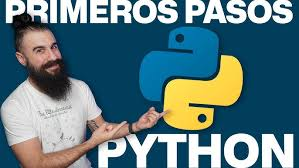
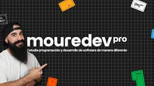

# Curso de PYTHON desde cero (BASICO)

Estos son mis apuntes del curso Básico de Python impartido por Brais Moure.

Liga del curso en youtube:

[)](https://youtu.be/Kp4Mvapo5kc?si=5alnFihEZBYzox36)

Temas del curso:

1. Configuración
2. Hola Mundo
3. Variables
4. Operadores
5. Strings
6. Listas
7. Tuplas
8. Sets
9. Diccionarios
10. Condicionales
11. Bucles/Loops/Ciclos
12. Funciones
13. Clases
14. Excepciones
15. Módulos

Te recomiendo que te inscribas a su plataforma **Mouredev Pro**

