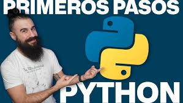

# Curso de PYTHON desde cero (BASICO)

Estos son mis apuntes del curso Básico de Python impartido por Brais Moure.

Liga del curso en youtube:

Temas del curso:

1. Configuración
2. Hola Mundo
3. Variables
4. Operadores
5. Strings
6. Listas
7. Tuplas
8. Sets
9. Diccionarios
10. Condicionales
11. Bucles/Loops/Ciclos
12. Funciones
13. Clases
14. Excepciones
15. Módulos

Te recomiendo que te inscribas a su plataforma **Mouredev Pro**

Enlaces de interés:

- Página oficial de python:
- Documentación Oficial de python: https://docs.python.org/es/3/
- Tutorial oficial de python: https://docs.python.org/es/3/tutorial/index.html
- Repositorio "30 días de Python": https://github.com/Asabeneh/30-Days-Of-Python
- Juego Códex para aprender python: https://www.codedex.io/python
- Página de Stack Overflow para python: https://es.stackoverflow.com/questions/tagged/python
- Página de W3Schools para aprender python: https://www.w3schools.com/python
- Página de GeeksforGeeks para aprender python: https://www.geeksforgeeks
- Página de Real Python para aprender python: https://realpython.com/
- Página de Python.org para aprender python: https://www.python.org/
- Página de Tutorials Point para aprender python: https://www.tutorialspoint.com/python
- Página de W3Techs para aprender python: https://www.w3techs.com
